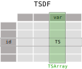

============
Key Concepts
============

-----------
Time series
-----------

A time series is a sequence of data indexed by timestamps, which can be univariate or multivariate as long as the index is shared across variables. In the `TStore` specification, a time series is represented by a `TS` object.

-------
TSArray
-------

A `TSArray` is an array of `TS` objects. It is actually [a pandas `ExtensionArray` which is used to support custom data types](https://pandas.pydata.org/docs/reference/api/pandas.api.extensions.ExtensionArray.html). For instance, given a list of stations, a `TSArray` can be used to map each station to a `TS` object with the corresponding time series of observed data.

----
TSDF
----

A `TSDF` is a table-like object where each column is a `TSArray`. It is a convenient way to map multiple time series (e.g., multiple variables) to a common index (e.g., a given station). The following diagram illustrates how a `TSDF` object is composed of `TSArray` objects, which are themselves composed of `TS` objects:

**When is this useful?** Consider the case of meteorological observations, where different stations may feature different sensors to record different variables, e.g., temperature, precipitation, wind speed, etc. Stations may have different observation frequencies, periods of inoperation or missing data and the like. Therefore it may not be appropriate to store all the observations within the same table in the so-called long-format as this could result in many NaN values across columns and duplicated timestamps. Instead, the observations can be structured as a `TSArray` with a dedicated `TS` object for each station.

Additionally, it may be appropriate to store the observations of different variables in separate `TSArray` objects, which can be combined in a `TSDF` object. This is particularly useful when a station is equipped with multiple sensors to record different variables, which may have different observation frequencies. In fact, variables such as precipitation may have long periods without records, which would result in many NaN values in a multivariate time series.

------
TSLong
------

In a **long-form data table**, each variable corresponds to a column and each observation corresponds to a row.

------
TSWide
------

In a **wide-form data table**, columns and rows contain levels of a variable. Each observation is defined by its value at the cell and its coordinates in both the row and column indices.

------
TStore
------

A `TStore` is a hierarchically-structured specification to efficiently store geospatial time series data based on `Apache Parquet <https://parquet.apache.org>`_ and `GeoParquet <https://github.com/opengeospatial/geoparquet>`_. It is designed to store `TSDF` objects in a way that allows for efficient querying of heterogeneous time series data. Consider a set of "n" stations (rows of a `TSDF`) with temperature and precipitation observations (columns of a `TSDF`). Storing such a `TSDF` in a `TStore` would result in a directory structure of the form:

::

    <base_tstore_dir>
    ├── <station-id-1>
    │   ├── <temperature>
    │   │   ├── <year-1>
    │   │   │   ...
    │   │   └── <year-k>
    │   └── <precipitation>
    │       ├── <year-1>
    │       │   ...
    │       └── <year-k>
    │   ...
    ├── <station-id-n>
    │   ├── <temperature>
    │   │   ├── <year-1>
    │   │   │   ...
    │   │   └── <year-k>
    │   └── <precipitation>
    │       ├── <year-1>
    │       │   ...
    │       └── <year-k>
    │   ...

Note that the time series data of each station and variable is stored in a separate directory, which the above example is further partitioned by year, but the user may choose a different temporal partitioning scheme.

----------------

You are now ready to explore the various :ref:`tutorials <tutorials>` available in the documentation and learn more about the TStore functionalities.
