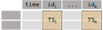
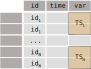

============
Key Concepts
============

-----------------------------
Representing time series data
-----------------------------

In most cases, datasets with repeated measures can be represented in two main ways, namely the **wide** and **long** forms. Even though the definition for these forms can be fuzzy, when dealing with time series data, there is an essential distinction: *wide data frames do not have repeated timestamps in the time column*.

Consider a set of observations from meteorological stations (e.g., id\ :sub:`1` to id\ :sub:`N)`. In a **wide data frame**, each station would have a column with its time series of measurements:

  Wide time series data frame

We could still represent multiple variables, e.g., by having columns of the form temperature\ :sub:`1`, humidity\ :sub:`1`, pressure\ :sub:`1`, until temperature\ :sub:`N`, humidity\ :sub:`N`, pressure\ :sub:`N`, or even use hierarchical multi-level columns where for each station id (first level) we have the three variables (second level). Again, the distinctive aspect of wide data frames is that there are no repeated timestamps in the time column. Instead, we could represent the same data as a **long data frame** by stacking each time series of measurements into a single column and adding a categorical column to map each observation to a station:

  Long time series data frame

Note that in the long form we will most likely have repeated timestamps in the time column.

The wide data frame is likely more suited to cases in which the time series are *aligned*, e.g., station measurements TS\ :sub:`1` to TS\ :sub:`N` are indexed by the same timestamps. Otherwise, we may end up with many NaN values, e.g., when some stations have data each 10 minutes and others have data each hour. Under these circumstances, it may be better to use a long data frame in which the timestamps for each station can be completely different.

-------------------------
Time series encapsulation
-------------------------

To facilitate the task of dealing with heterogeneous time series datasets, the tstore library provides several objects to encapsulate and index time series data.

TS
==

A time series is a sequence of data indexed by timestamps, which can be univariate or multivariate as long as the index is shared across variables. In the `TStore` specification, a time series is represented by a `TS` object.

TSArray
=======

A `TSArray` is an array of `TS` objects. It is actually a pandas `ExtensionArray` `which is used to support custom data types <https://pandas.pydata.org/docs/reference/api/pandas.api.extensions.ExtensionArray.html>`_. For instance, given a list of stations, a `TSArray` can be used to map each station to a `TS` object with the corresponding time series of observed data.

TSDF
====

A `TSDF` is a pandas data frame object where multiple columns can be of type `TSArray`. It is a convenient table-format to map multiple time series (e.g., multiple variables) to a common index (e.g., a given station). The following diagram illustrates how a `TSDF` object is composed of `TSArray` objects, which are themselves composed of `TS` objects:

.. image:: static/tsdf.svg
  :width: 400
  :alt: TSDF

**When is this useful?** Consider again the case of meteorological observations, where different stations may feature different sensors to record different variables, e.g., temperature, precipitation, wind speed, etc. Stations may have different observation frequencies, periods of inoperation or missing data and the like. Therefore it may not be appropriate to store all the observations within the same table in the so-called long-format as this could result in many NaN values across columns and duplicated timestamps. Instead, the observations can be structured as a `TSArray` with a dedicated `TS` object for each station.

Additionally, it may be appropriate to store the observations of different variables in separate `TSArray` objects, which can be combined in a `TSDF` object. This is particularly useful when a station is equipped with multiple sensors to record different variables, which may have different observation frequencies.

------
TStore
------

A `TStore` is a hierarchically-structured specification to efficiently store geospatial time series data based on `Apache Parquet <https://parquet.apache.org>`_ and `GeoParquet <https://github.com/opengeospatial/geoparquet>`_. It is designed to store `TSDF` objects in a way that allows for efficient querying of heterogeneous time series data. Consider a set of "n" stations (rows of a `TSDF`) with temperature and precipitation observations (columns of a `TSDF`). Storing such a `TSDF` in a `TStore` would result in a directory structure of the form:

::

    <base_tstore_dir>
    ├── <station-id-1>
    │   ├── <temperature>
    │   │   ├── <year-1>
    │   │   │   ...
    │   │   └── <year-k>
    │   └── <precipitation>
    │       ├── <year-1>
    │       │   ...
    │       └── <year-k>
    │   ...
    ├── <station-id-n>
    │   ├── <temperature>
    │   │   ├── <year-1>
    │   │   │   ...
    │   │   └── <year-k>
    │   └── <precipitation>
    │       ├── <year-1>
    │       │   ...
    │       └── <year-k>
    │   ...

Note that the time series data of each station and variable is stored in a separate directory, which the above example is further partitioned by year, but the user may choose a different temporal partitioning scheme.

----------------

You are now ready to explore the various :ref:`tutorials <tutorials>` available in the documentation and learn more about the TStore functionalities.
